<div align="center">

# 

[](https://github.com/Manik0107)
[](https://github.com/Manik0107)
[](https://linkedin.com/in/manik-manavenddra)

</div>

<div align="center">
  
### 🚀 Building AI Systems That Ship to Production — Not Just Demos

I architect and develop **end-to-end AI systems** that go beyond prototypes. My focus is on **LLM-powered applications**, **retrieval-augmented generation (RAG)**, **AI agents**, and **developer tooling** designed for real-world scale, performance, and maintainability.

</div>

---

<div align="center">

## 

### Languages


### AI / ML


### Backend


### Frontend


### DevOps & Tools


</div>

---


<div align="center">

## 

</div>

### <span style="color: #70A5FD;">AI Hiring Manager</span>
**End-to-End Automated Hiring Platform with AI-Powered Evaluation**

[](https://github.com/Manik0107/AI_Hiring_Manager)
[](https://github.com/Manik0107/AI_Hiring_Manager)

> **• Full hiring automation** — from resume screening to candidate onboarding  
> **• LLM-based structured evaluation** — deterministic insights, not vague AI outputs  
> **• Multi-round assessment pipeline** — quiz generation, scoring, and offer automation  
> **• Production-grade architecture** — FastAPI + PostgreSQL + React

**Tech Stack:** `Python` `FastAPI` `PostgreSQL` `React` `OpenRouter` `Agno Agents` `Vector DB`

**Key Features:**
- Resume parsing and scoring with RAG
- Multi-round quiz generation via LLM agents
- Audio interview support with real-time transcription
- Automated offer letter generation and email delivery
- Re-attempt system for transparent candidate evaluation

---

### <span style="color: #70A5FD;">Text2Ink</span>
**Typed Documents → Realistic Handwritten PDF Notes with AI Diagrams**

[](https://github.com/Manik0107/Text2Ink)

> **• Handwriting synthesis** — converts typed text into realistic handwritten PDFs  
> **• Intelligent diagram generation** — Agno agents select optimal Mermaid.js diagrams  
> **• Floating layout engine** — professional textbook-style page composition  
> **• Production quality** — clean, readable, publication-ready outputs

**Tech Stack:** `Python` `Agno Agents` `Mermaid.js` `PIL` `PyMuPDF`

**Key Features:**
- AI-powered content analysis for diagram selection
- Smart vertical layout optimization (maximizes diagram visibility)
- Floating figure layout (eliminates vertical gaps)
- Strict diagram scaling (always fits within page bounds)

---

### <span style="color: #70A5FD;">Code2Doc</span>
**Automated Repository Documentation Generator with Workflow Diagrams**

[](https://github.com/Manik0107/Code2Doc)

> **• Automated documentation** — analyzes source code and generates structured docs  
> **• Deep codebase analysis** — extracts functions, classes, dependencies, and logic  
> **• Workflow diagram generation** — visualizes repository architecture  
> **• Professional PDF output** — clean, consistent, production-ready documentation

**Tech Stack:** `Python` `Agno Agents` `AST Parsing` `GitHub API` `PyMuPDF` `Mermaid.js`

**Key Features:**
- GitHub repository integration
- Automatic workflow diagram generation
- Structured content generation via LLM agents
- Clean PDF output with justified text and embedded diagrams

---

### <span style="color: #70A5FD;">VATA</span>
**Conversational AI Agent Framework for Task Execution**

[](https://github.com/Manik0107/VATA)

> **• Task-oriented AI assistant** — designed for action, not just conversation  
> **• Tool calling & API integration** — extensible agent framework  
> **• Multi-step reasoning** — maintains conversational state and context  
> **• Modular architecture** — clean separation of concerns

**Tech Stack:** `Python` `FastAPI` `LLM APIs` `Tool Execution Layer`

**Key Features:**
- Agentic AI design with tool calling
- State management for context retention
- Modular prompt architecture
- Extensible tool integration

---

<div align="center">

## 



</div>

```mermaid
graph LR
    A[💡 Problem] --> B[🔍 Research & Planning]
    B --> C[🏗️ Architecture Design]
    C --> D[⚙️ Implementation]
    D --> E[🧪 Testing & Validation]
    E --> F[🚀 Deployment]
    F --> G[📊 Monitoring & Iteration]
    G --> A
    
    style A fill:#a9fef7,stroke:#1a1b27,stroke-width:2px,color:#1a1b27
    style B fill:#70a5fd,stroke:#1a1b27,stroke-width:2px,color:#1a1b27
    style C fill:#f5c2e7,stroke:#1a1b27,stroke-width:2px,color:#1a1b27
    style D fill:#cba6f7,stroke:#1a1b27,stroke-width:2px,color:#1a1b27
    style E fill:#f9e2af,stroke:#1a1b27,stroke-width:2px,color:#1a1b27
    style F fill:#a6e3a1,stroke:#1a1b27,stroke-width:2px,color:#1a1b27
    style G fill:#fab387,stroke:#1a1b27,stroke-width:2px,color:#1a1b27
```

### 🎯 Engineering Principles I Live By

```
🏗️  Architecture First    → Design systems that scale before writing code
⚡  Production > Prototypes → Ship real products, not impressive demos
🎯  Deterministic AI       → Structured outputs over vague LLM responses
🧩  Modular Design         → Build composable, reusable components
🔍  Systems Thinking       → Understand the full stack, not isolated features
📚  Document Everything    → Code clarity and maintainability matter
🚀  Ship Iteratively       → Deploy early, gather feedback, improve continuously
```

---

<div align="center">

## 

[](https://github.com/Manik0107)
[](https://linkedin.com/in/manik-manavenddra)
[](mailto:manikmanavenddra@gmail.com)

### 💼 Open to Collaboration

I'm interested in working on **serious AI products** and **developer tools** that solve real problems.  
If you're building something ambitious, let's talk!

</div>

---

<div align="center">

### ⭐ If you find my work interesting, consider starring my repositories!


---

<sub>✨ Built with passion for production-ready AI systems ✨</sub>

</div>
